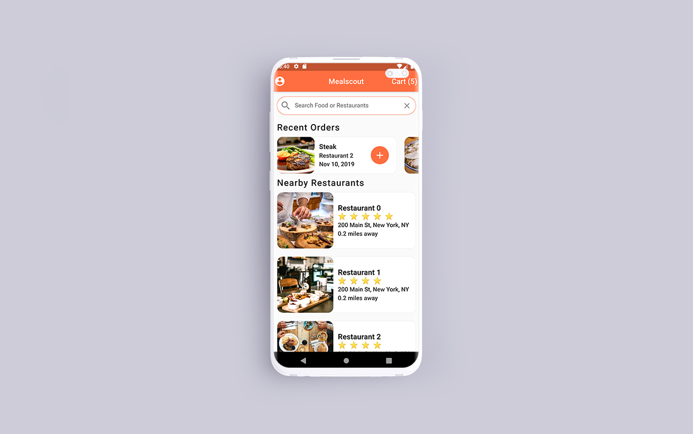
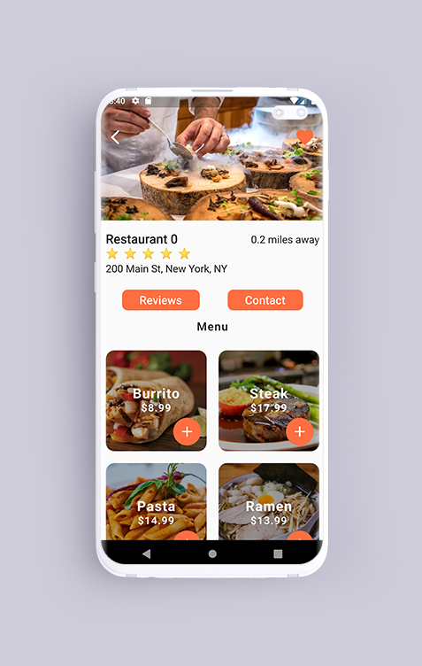
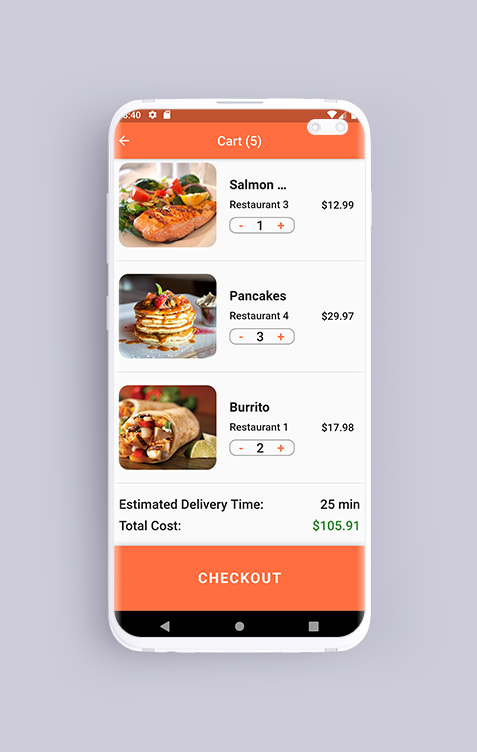

# Mealscout :bento:

A Food Delivery App UI using Flutter. No External Library or package has been used. I developed it to practice Flutter on my Free Time. :beers:

[](https://opensource.org/licenses/Apache-2.0)
[](https://github.com/shameemreza/mealscout/blob/main/LICENSE)

The source code is **100% Dart**, and everything resides in the [/lib](https://github.com/shameemreza/mealscout/tree/master/lib) folder.

# Screenshots



## License

```
Copyright 2021 Shameem Reza

Licensed under the Apache License, Version 2.0 (the "License");
you may not use this file except in compliance with the License.
You may obtain a copy of the License at

   http://www.apache.org/licenses/LICENSE-2.0

Unless required by applicable law or agreed to in writing, software
distributed under the License is distributed on an "AS IS" BASIS,
WITHOUT WARRANTIES OR CONDITIONS OF ANY KIND, either express or implied.
See the License for the specific language governing permissions and
limitations under the License.
```

## Getting Started with Flutter

For help getting started with Flutter, view our online
[documentation](https://flutter.io/).
